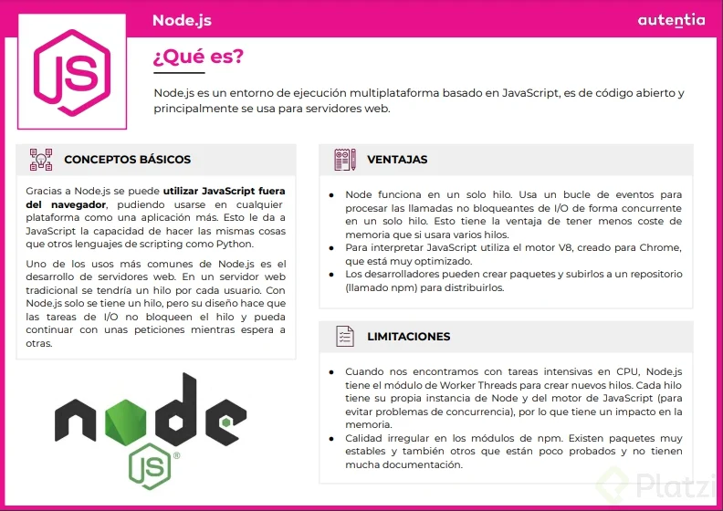
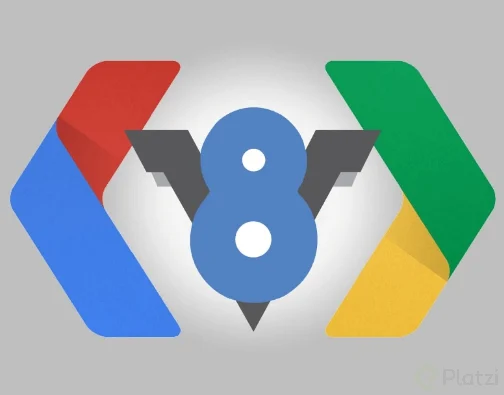

# Clase 04 - Profundizamos la teoría en Node

En esta clase profundizamos en los fundamentos teóricos de Node.js, entendiendo su arquitectura interna, el uso del motor V8 y cómo opera el mecanismo de asincronía.

---

## 4.1 Aclarando teorías

Para entender qué es Node.js en profundidad, partimos de los siguientes conceptos clave:

* **¿Qué es?:** Es un entorno de ejecución multiplataforma de código abierto, basado en JavaScript, diseñado principalmente para construir servidores web y aplicaciones escalables fuera del navegador.
* **El Motor V8:** Node.js utiliza el motor **V8** creado por Google para Chrome, el cual está altamente optimizado para compilar y ejecutar código JavaScript a alta velocidad.
* **Modelo Monohilo (Single-Thread):** A diferencia de los servidores tradicionales (que abren un hilo por cada usuario conectado), Node.js funciona en un **único hilo**. Esto reduce drásticamente el consumo de memoria. Su gran ventaja es que maneja las tareas de I/O (Entrada/Salida) de forma **no bloqueante**, permitiendo atender nuevas peticiones mientras espera que otras terminen.
* **Limitaciones a tener en cuenta:** 
  * Al ser monohilo, las tareas muy pesadas o intensivas en CPU pueden bloquear el hilo principal. Para solucionarlo, Node.js cuenta con el módulo de *Worker Threads* (donde cada hilo tiene su propia instancia para evitar problemas de concurrencia, aunque con mayor costo de memoria).
  * La calidad de los paquetes en **npm** puede ser variable; conviven módulos extremadamente sólidos y estables con otros que tienen poca documentación o soporte.

---

## 4.2 Event Loop (Bucle de eventos)

El **Event Loop** es el corazón arquitectónico que hace posible la asincronía en Node.js. Su funcionamiento interno se compone de las siguientes partes:

1. **Event Queue (Cola de Eventos):** Almacena las peticiones, eventos y funciones que van llegando.
2. **El Bucle (Event Loop):** Monitorea constantemente esta cola de manera eficiente en un solo hilo.
3. **Thread Pool (Grupo de Hilos):** Cuando el sistema se encuentra con operaciones pesadas (como consultas a bases de datos - *DB Ops*, manejo de archivos - *File*, u operaciones lentas - *Slow Ops*), estas se delegan fuera del hilo principal a un conjunto de hilos secundarios (*Thread Pool*). Una vez procesadas, devuelven el resultado al bucle para responder.

.png)
